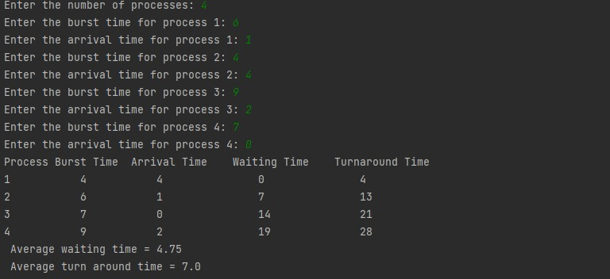

# Assignment2
A java code that implements Round Robin and Shortest Job First algorithms in CPU Scheduling 

## Round Robin Algorithm
This code takes information about each process from the user , for example : burst time , arrival time and quantum time then make the CPU scheduling ;
output contains waiting time , turn around time for each process ; We can see the code in <a href="https://github.com/Menna-Islam/Assignment2/blob/main/src/RoundRobinAlgorithm.java">RoundRobin.java</a> file.

## Shortest Job First Algorithm 
Same functionality as round robin but without quantum time , It depends on shortest burst time with respect to arrival time for each process 
; We can see the code in <a href="https://github.com/Menna-Islam/Assignment2/blob/main/src/SJFAlgorithm.java">SJF.java</a> file.

Thank you for your time :)
